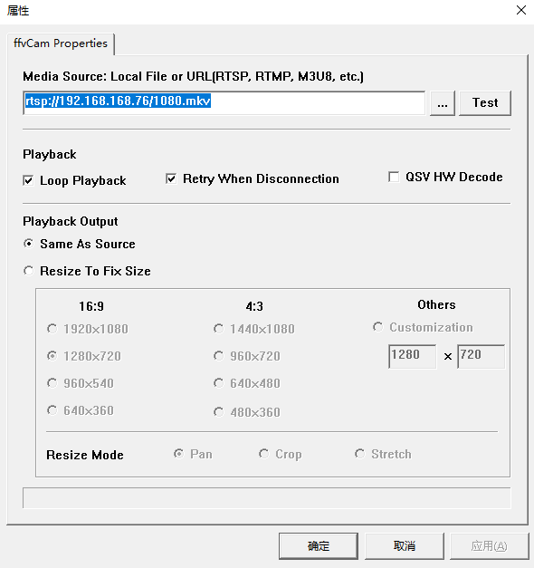

# ffvCam

This repository is based on Vivek's DirectSHow VCam. It has enhanced to support local video file or network video source playback. it also add a setting dialog to config video source and some more features.

### Config Guide
1. You can provide an URL for the video source or use "..." button to select a local media file.
2. Test button will check the video source and give the original vidoe size in bottom display area.
3. For local file, you can choose "Loop Playback", then it will auto loopback when play to end of file. Or for network video feed, you can choose "Retry When Disconnection", it will keep retry untill the video feed is available.
4. This vCam so far only support Intel QSV Hardware decode. For NvDec, raise PR.
5. This vCam only provide one MediaType (source filter's size), but the size is variable accoriding to settings. I suggest you choose "Resize To Fix Size" option, then you can get a stable source size. If you choose "Same As Source", it may give a default 1280x720 output. If you do want to use the source size and the source size is pretty stable, I suggest you use Resize option and choose Customization size (give url, test, then input the value to customization.)
6. It provides 3 resize mode.
> * Pan: Auto add black bars on top/bottom or left/right (depends on your input and output video ratio)
> * Crop: Clip the input to maxmize source video size (some video area will be crop to fit output ratio)
> * Stretch: This will not keep the source input video ratio
7. Due to the limitaion of original code, please use Apply button each time you want to save the settings. OK button did nothing except close the dialog. Sometime to make the setting take effect, you may need to restart the filter or application.
8. The settings will store into a ini file: .ffvcam\ffvcam.ini (under userprofile folder: e.g. D:\Users\blablabla\.ffvcam\ffvcam.ini).
9. It supports cusotmized background BMP image. To enable this feature, please put a file named ffvcam.bmp into the same folder as above ini file. So far it only support 24bit BMP format file. 

### Dependency

* VS2019 https://visualstudio.microsoft.com/
* ffmpeg4.4 http://ffmpeg.org/
* intel media sdk (for QSV decode) https://software.intel.com/content/www/us/en/develop/tools/media-sdk.html
* boost 1.76 https://www.boost.org/

Note: For directshow related .h and lib please refter to hootoovv's screenCam project directshow folder. You can change your variable in directshow.props to point to that folder.

### Steps

get ffmpeg 4.4 windows x64 build files (include, lib, dll) from https://www.gyan.dev/ffmpeg/builds/ffmpeg-release-full-shared.7z

get boost 1_76_0 from https://boostorg.jfrog.io/artifactory/main/release/1.76.0/source/boost_1_76_0.7z. It is a waste, for I only use the boost::thread.

start VS2019 cmd prompt, go to boost_1_76_0, run bootstrap.bat to generate boost build tool b2.exe

.\b2 toolset=msvc-142 architecture=x86 address-model=64 link=static threading=multi runtime-link=static --with-thread --with-date_time --with-log --with-filesystem

Note: To compile, don't forget change your directshow.props.

Below are original Readme
---

# DirectShow VCam

This repository contains [Vivek](https://groups.google.com/g/microsoft.public.win32.programmer.directx.video/c/1beZkSCb0KE/m/5VF366wR3CcJ)'s Capture Source Filter filter, a popular DirectShow sample project, which recently celebrated its 16th anniversary ([2005 posting reference](https://groups.google.com/g/microsoft.public.win32.programmer.directx.video/c/WRuNmZsWj-o/m/-l4sKR_2o-EJ)).

> Capture Source Filter filter (version 0.1) 86 KB zipped, includes binaries.  A sample source filter that emulates a video capture device contributed by Vivek (rep movsd from the public newsgroups).  Thanks Vivek!  TMH has not tested this filter yet.  Ask questions about this on microsoft.public.win32.programmer.directx.video.

This was hosted on [The March Hare's](https://web.archive.org/web/20060813155608/http://tmhare.mvps.org/) website for quite some time, and now when the website is gone people don't know where to look for the source code. Here it goes!

See also:

* [How to build and run Vivek's Virtual Camera on Windows 10?](https://stackoverflow.com/a/65698434/868014)
* [Errors in building Vivek's Virtual Camera on Windows 10?](https://stackoverflow.com/a/65758769/868014)

## Updates

Orignial source code is tagged by [original](https://github.com/roman380/tmhare.mvps.org-vcam/releases/tag/original) tag. In this state the project needs a bit of massaging to be beuilt.

The head of the repository is updated for Virtual Studio 2019 Community builds.

1. The project requires DirectShow BaseClasses, which is a part of Windows SDK moved to github. For this reason you need to pull https://github.com/roman380/Windows-classic-samples/tree/directshow/Samples/Win7Samples/multimedia/directshow (note branch "directshow") first and build the directshow.sln solution there (or at least BaseClasses project) first.
2. Then, edit [directshow.props](directshow.props) and modify line with `WindowsClassicSamplesDir` to have it point to root of repository from step 1 above
3. Then, open [vcam.sln](vcam.sln) and build this project

Differences from original version:

- output file name is Filters.dll (unlike original VCam.ax)
- the project is extended to have `x64` platform configuration

## How to use

Use Widows 10 SDK GraphEdit or [GraphStudioNext](https://github.com/cplussharp/graph-studio-next).

Locate "Virtual Cam" filter:

Build a pipeline and run:

## Further information

The VCam project has been discussed a lot in various forums. Most of them are archived and there are no active disussions, however there is still a lot of information online. Just a few pointers:

- [https://social.msdn.microsoft.com/Forums/...](https://social.msdn.microsoft.com/Forums/en-US/home?category=&forum=&filter=&sort=relevancedesc&brandIgnore=true&searchTerm=VCam)
- [https://groups.google.com/g/microsoft.public.win32.programmer.directx.video/...](https://groups.google.com/g/microsoft.public.win32.programmer.directx.video/search?q=VCam)
- [https://stackoverflow.com/...](https://stackoverflow.com/search?q=VCam)
